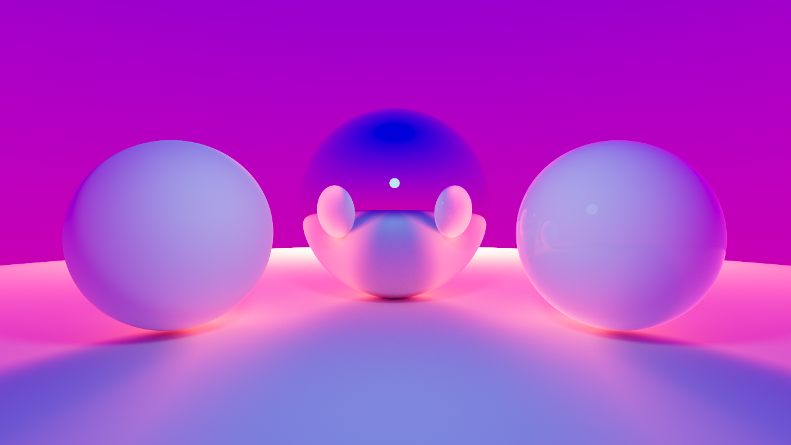

# miniRT
## Introduction
**High-Performance CPU Path Tracer with Monte Carlo Integration.**

> [!IMPORTANT]
>
> ⚠ This project is work in progress! ⚠
>
> Some of the features will not be implemented until the project has been validated. This is due to restrictions placed upon the subject.

> [!NOTE]
>
> Includes [MLX42](https://github.com/codam-coding-college/MLX42), a minimal graphics library required by the subject. It handles window creation and manages a frame buffer to which we copy ours.
>
> The `Makefile` will download and build MLX42, but it might require certain dependencies to be installed on your system. Refer to their [installation documentation](https://github.com/codam-coding-college/MLX42?tab=readme-ov-file#for-linux) for more information.
> Please ignore the section about XServer as it is no longer required for WSL2.

<p align="center">
	
</p>

## Features
- Monte Carlo integration with importance sampling for Global Illumination
- BVH acceleration structure for rapid intersection testing
- Modest post-processing stack with ACES-calibrated tonemapping
- High-performance CPU parallelism with multi-threading, memory efficiency, and systems-level optimisations enabling vectorisation of data
- PBR material model with importance-sampled GGX specular, Smith-Schlick geometry shadowing, and Disney diffuse

#### TODO
- Additional primitive objects
- Texture maps and procedural patterns
- Normal maps
- Extented camera properties and trackball controls
- Quaternions
- Object editing with simplified rendering mode

#### Future Work
- Discard the restrictive coding standard required by the subject and refactor to more efficient code
- Image based lighting
- VNDF sampling for indirect specular light
- Additional post-processing modules
- Denoising solution
- Loading .ojb meshes
- Port the rendering kernel to CUDA and refactor data to Structure of Arrays (SoA) to ensure coalesced global memory access
- Replace MLX42 with GPU interop to render directly to the display buffer, avoiding data transfer back to CPU

## Optimisation & Performance
This project implements a highly optimised CPU rendering engine, balancing code readability with raw performance.

By analysing assembly output with GDB and compiler behaviour, several optimisations were implemented to maximise throughput with auto-vectorisation. Building on these performance gains, data structures were vectorised explicitly.

Our approach optimises memory alignment for SIMD (Single Instruction, Multiple Data) execution while delegating most of the instruction selection to the compiler, maintaining a clean codebase.

### Math Utilities
- High-performance linear algebra library providing SIMD-accelerated, memory-aligned vector and matrix primitives.

### Blit Function

#### Vectorised Preview Mode

- Used during the camera movement. Achieves pure SIMD execution, processing 4 pixels in parallel per instruction cycle to maximize frame rate at the cost of slight image quality reduction.

#### Pipelined Refine Mode

- Leverages explicit loop unrolling to maximize Instruction Level Parallelism (ILP). While color channel dependencies limit vectorisation in this stage, unrolling reduces branch prediction overhead and saturates the CPU's superscalar execution.

### BVH

- Documentation under construction

### Micro-optimisations

- Invariant caching to local variables to prevent pointer aliasing.

- Branchless arithmetic to minimise CPU stalls in performance-critical loops.

- Strategically segregated write-heavy synchronization primitives from read-only render data to eliminate false sharing and cache line invalidation.

## Physically Based Rendering

- Documentation under construction

## Monte Carlo Integration

- Documentation under construction

## How to use

> [!NOTE]
> The default build configuration targets the Haswell microarchitecture (Intel 2013+ / AMD Ryzen).
>
> If you are compiling on legacy hardware, please replace `-march=haswell` with `-msse4.1` in the Makefile to ensure compatibility.

Run the following commands to clone the repository and create `miniRT` program
``` git
git clone https://github.com/mordori/miniRT.git miniRT
cd miniRT
make
```

Run the program with a .rt scene file
``` bash
./miniRT assets/scenes/test.rt
```

To delete all of the generated files, use
``` Makefile
make fclean
```
<br>

## Scene description
Premade scenes can be found in `📁assets/scenes/`.

As the project is still under construction, we recommend to run the program with
``` bash
./miniRT assets/scenes/test.rt
```

<br>

## Controls

### Camera

| ⠀⠀⠀⠀⠀⠀⠀⠀⠀⠀Key⠀⠀⠀⠀⠀⠀⠀⠀⠀⠀                                     | ⠀⠀⠀⠀⠀⠀⠀⠀⠀⠀⠀⠀⠀⠀⠀⠀Description⠀⠀⠀⠀⠀⠀⠀⠀⠀⠀⠀⠀⠀⠀⠀⠀        |
|----------------------------------------------------------------|-----------------------------------------------------------|
| <kbd>Left ALT</kbd> + <kbd>Left Mouse Button</kbd> and drag    | Orbit Camera                                              |

### Editing

| ⠀⠀⠀⠀⠀⠀⠀⠀⠀⠀Key⠀⠀⠀⠀⠀⠀⠀⠀⠀⠀                                     | ⠀⠀⠀⠀⠀⠀⠀⠀⠀⠀⠀⠀⠀⠀⠀⠀Description⠀⠀⠀⠀⠀⠀⠀⠀⠀⠀⠀⠀⠀⠀⠀⠀         |
|----------------------------------------------------------------|-----------------------------------------------------------|
| <kbd>Left Arrow</kbd> - <kbd>Right Arrow</kbd>                 | Rotate skydome                                            |

### General

| ⠀⠀⠀⠀⠀⠀⠀⠀⠀⠀Key⠀⠀⠀⠀⠀⠀⠀⠀⠀⠀                                     | ⠀⠀⠀⠀⠀⠀⠀⠀⠀⠀⠀⠀⠀⠀⠀⠀Description⠀⠀⠀⠀⠀⠀⠀⠀⠀⠀⠀⠀⠀⠀⠀⠀         |
|----------------------------------------------------------------|-----------------------------------------------------------|
| <kbd>Esc</kbd>                                                 | Quit                                                      |
