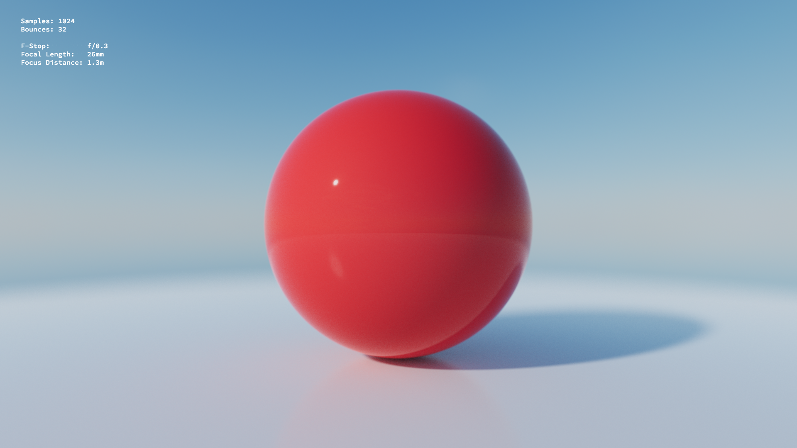
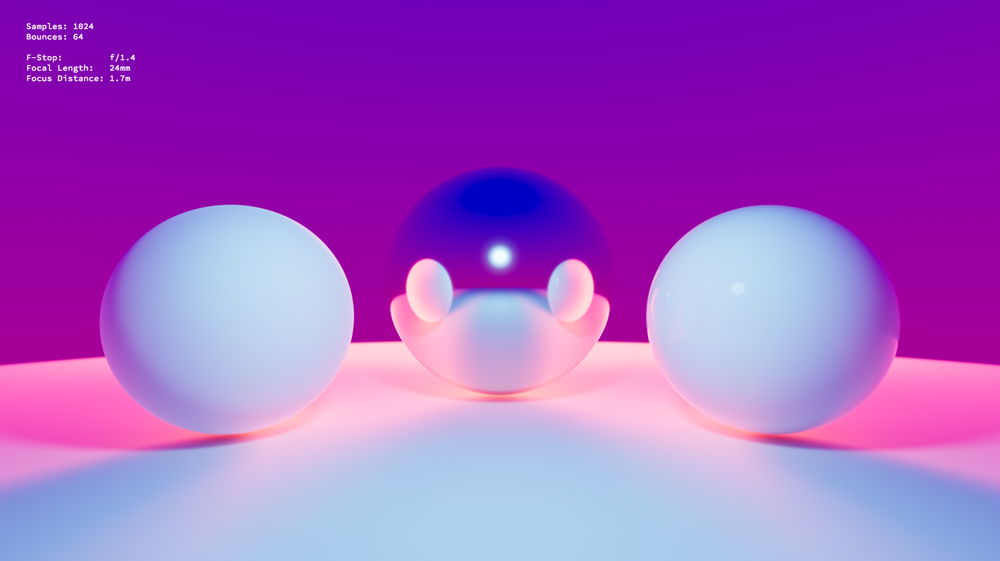

# miniRT
## Introduction
**High-Performance CPU Path Tracer with Quasi-Monte Carlo Integration.**

<p align="center">
	
</p>

> [!IMPORTANT]
>
> ⚠ This project is work in progress! ⚠
>
> MacOS / Apple Silicon is not currently supported.
>
> Some of the features will not be implemented until the project has been validated. This is due to restrictions placed upon the subject.

> [!NOTE]
>
> Includes [MLX42](https://github.com/codam-coding-college/MLX42), a minimal graphics library required by the subject. It handles window creation and manages a frame buffer to which we copy ours.
>
> The `Makefile` will download and build MLX42, but it might require certain dependencies to be installed on your system. Refer to their [installation documentation](https://github.com/codam-coding-college/MLX42?tab=readme-ov-file#for-linux) for more information.
> Please ignore the section about XServer as it is no longer required for WSL2.

<p align="center">
	
</p>

<p align="center">
	
</p>

## Features
- Quasi-Monte Carlo integration with multiple importance sampling for Global Illumination
- BVH acceleration structure for rapid intersection testing
- Modest post-processing stack with ACES-calibrated tonemapping
- High-performance CPU parallelism with multi-threading, memory efficiency, and systems-level optimisations enabling vectorisation of data
- Modern PBR pipeline with microfacet BSDF
- Custom scene description format
- Bilinear texture filtering
- Plane, sphere, cylinder, and cone primitives
- Physical camera with fly controller

#### TODO
- Anisotropic & clear coat BRDF
- BTDF for BSDF
- Procedural patterns
- Normal maps
- Trackball controller for Edit Mode
- Quaternions and proper transforms
- Object editing

#### Future Work
- Support for MacOS and Apple Silicon
- Image based lighting
- EV100 exposure triangle
- Additional post-processing modules
- Denoising solution
- Quads and boxes
- Loading .ojb meshes
- Improve the BVH
- Port the rendering kernel to CUDA and refactor data to Structure of Arrays (SoA) to ensure coalesced global memory access
- Replace MLX42 with GPU interop to render directly to the display buffer, avoiding data transfer back to CPU

## Physically Based Rendering
### BSDF
Principled BSDF, a hybrid material model featuring Disney diffuse and Cook-Torrance specular lobes.

- Implements Dupuy's 2023 spherical cap VNDF sampling method for efficient visible microfacet normal generation.
- Height-correlated Smith G2 visibility and analytically simplified Smith G1 masking to maintain stable 32-bit floating point weights.
- Firefly mitigation and defense against variance spikes with indirect weight clamping, path roughing, and NaN/Inf sanitisation.

### Camera
- Physically based lens model with adjustable Focal Length, Focus Distance, and F-Stop.
- Utilises a simplified manual exposure. Full EV100 exposure triangle integration is planned for future updates.

## Optimisation & Performance
Implements a highly optimised CPU rendering engine, balancing code readability with raw performance.

By analysing assembly output with GDB and compiler behaviour, several optimisations were implemented to maximise throughput with auto-vectorisation. Building on these performance gains, data structures were vectorised explicitly.

Our approach optimises memory alignment for SIMD (Single Instruction, Multiple Data) execution while delegating most of the instruction selection to the compiler, maintaining a clean codebase.

### Math Utilities
- High-performance linear algebra library providing SIMD-accelerated, memory-aligned vector and matrix primitives.

### Blit Function
#### Vectorised Preview Mode
- Used during the camera movement. Achieves pure SIMD execution, processing 4 pixels in parallel per instruction cycle to maximize frame rate at the cost of slight image quality reduction.

#### Pipelined Rendered Mode
- Leverages loop unrolling to maximize instruction level parallelism. While color channel dependencies limit vectorisation in this stage, unrolling reduces branch prediction overhead and saturates the CPU's superscalar execution.

### BVH
- Documentation under construction

### Micro-optimisations
- Invariant caching to local variables to prevent pointer aliasing.
- Branchless arithmetic to minimise CPU stalls in performance-critical loops.
- Strategically segregated write-heavy synchronization primitives from read-only render data to eliminate false sharing and cache line invalidation.

## Quasi-Monte Carlo Integration
- Documentation under construction

### RNG
- Documentation under construction

## How to use
> [!NOTE]
> The default build configuration targets the Haswell microarchitecture (Intel 2013+ / AMD Ryzen).
>
> If you are compiling on legacy hardware, please replace `-march=haswell` with `-msse4.1` in the Makefile to ensure compatibility.

Run the following commands to clone the repository and create `miniRT` program
``` git
git clone https://github.com/mordori/miniRT.git miniRT
cd miniRT
make
```

Run the program with a .rt scene file
``` bash
./miniRT assets/scenes/test.rt
```

## Scene description
Premade scenes can be found in `📁assets/scenes/`.

As the project is still under construction, we recommend to run the program with
``` bash
./miniRT assets/scenes/test.rt
```

> [!TIP]
>
> Adjust the camera's focus distance to desired surfaces easily in edit mode when using a lower f-stop to produce a shallow depth of field.
>
> **Previously accumulated frames are not wasted!**
>
> Set the amount of samples lower with <kbd>O</kbd> and find the desired angle for the shot first. Then increment the amount with <kbd>P</kbd> for better image quality.
>
> Setting the samples amount to be less than the current frame pauses the rendering. To continue, raise the samples to the previous amount.
>
> Pressing <kbd>Y</kbd> saves the current render image as a PPM image into `📁renders/`.

## Controls
### Render Mode
| Key⠀⠀⠀⠀⠀⠀⠀⠀⠀⠀⠀⠀⠀⠀⠀⠀⠀⠀⠀                                     | Navigation          ⠀⠀⠀⠀⠀⠀⠀⠀⠀⠀⠀⠀⠀⠀⠀⠀⠀⠀⠀⠀  |
|----------------------------------------------------------------|-----------------------------------------------|
| <kbd>LMB</kbd>                                                 | Rotate                                        |
| <kbd>W</kbd> <kbd>A</kbd> <kbd>S</kbd> <kbd>D</kbd>            | Move                                          |
| <kbd>SHIFT</kbd> / <kbd>SPACE</kbd>                            | Descend / Ascend                              |

### Edit Mode
| Key⠀⠀⠀⠀⠀⠀⠀⠀⠀⠀⠀⠀⠀⠀⠀⠀⠀⠀⠀                                     | Navigation          ⠀⠀⠀⠀⠀⠀⠀⠀⠀⠀⠀⠀⠀⠀⠀⠀⠀⠀⠀⠀  |
|----------------------------------------------------------------|-----------------------------------------------|
| <kbd>TAB</kbd>                                                 | Toggle Edit Mode                              |

| Key⠀⠀⠀⠀⠀⠀⠀⠀⠀⠀⠀⠀⠀⠀⠀⠀⠀⠀⠀                                     | Action           ⠀⠀⠀⠀⠀⠀⠀⠀⠀⠀⠀⠀⠀⠀⠀⠀⠀⠀⠀⠀⠀⠀⠀  |
|----------------------------------------------------------------|-----------------------------------------------|
| <kbd>F</kbd>                                                   | Frame Selected                                |
| <kbd>ALT</kbd> + <kbd>LMB</kbd>                                | Orbit                                         |
| <kbd>ALT</kbd> + <kbd>LMB</kbd>                                | Zoom                                          |
| <kbd>ALT</kbd> + <kbd>LMB</kbd>                                | Pan                                           |

| Key⠀⠀⠀⠀⠀⠀⠀⠀⠀⠀⠀⠀⠀⠀⠀⠀⠀⠀⠀                                     | Editing          ⠀⠀⠀⠀⠀⠀⠀⠀⠀⠀⠀⠀⠀⠀⠀⠀⠀⠀⠀⠀⠀⠀⠀  |
|----------------------------------------------------------------|-----------------------------------------------|
| <kbd>LMB</kbd>                                                 | Select Object                                 |
| <kbd>W</kbd>                                                   | Move                                          |
| <kbd>E</kbd>                                                   | Rotate                                        |
| <kbd>R</kbd>                                                   | Scale                                         |
| <kbd>X</kbd> / <kbd>Y</kbd> / <kbd>Z</kbd>                     | Axis Constraint                               |
| <kbd>SHIFT</kbd> + <kbd>X</kbd> / <kbd>Y</kbd> / <kbd>Z</kbd>  | Plane Constraint                              |

### General
| Key⠀⠀⠀⠀⠀⠀⠀⠀⠀⠀⠀⠀⠀⠀⠀⠀⠀⠀⠀                                     | Action           ⠀⠀⠀⠀⠀⠀⠀⠀⠀⠀⠀⠀⠀⠀⠀⠀⠀⠀⠀⠀⠀⠀⠀  |
|----------------------------------------------------------------|-----------------------------------------------|
| <kbd>R</kbd>                                                   | Reset Camera                                  |
| <kbd>,</kbd> / <kbd>.</kbd>                                    | Rotate Skydome                                |
| <kbd>↓</kbd> / <kbd>↑</kbd>                                    | Focus Distance                                |
| <kbd>←</kbd> / <kbd>→</kbd>                                    | Aperture                                      |
| <kbd>K</kbd> / <kbd>L</kbd>                                    | Focal Length                                  |
| <kbd>O</kbd> / <kbd>P</kbd>                                    | Samples                                       |
| <kbd>U</kbd> / <kbd>I</kbd>                                    | Bounces                                       |
| <kbd>H</kbd>                                                   | Toggle Settings                               |
| <kbd>Y</kbd>                                                   | Save render                                   |
| <kbd>ESC</kbd>                                                 | Quit                                          |

## Project Review
- Documentation under construction

## Resources
Path tracing
- https://raytracing.github.io/
- https://www.pbr-book.org/
- https://scratchapixel.com/index.html
- https://users.aalto.fi/~lehtinj7/CS-E5520/2023/
- https://jacco.ompf2.com/articles/
- The Ray Tracer Challenge by Jamis Buck

PBR
- https://google.github.io/filament/main/filament.html
- https://blog.selfshadow.com/
- https://graphicrants.blogspot.com/2013/08/specular-brdf-reference.html
- https://cdn2.unrealengine.com/Resources/files/2013SiggraphPresentationsNotes-26915738.pdf

VNDF
- https://arxiv.org/pdf/2306.05044
- https://www.youtube.com/watch?v=u7TafvTVmbo

Math
- https://immersivemath.com/ila/index.html
- https://www.3blue1brown.com/
- https://betterexplained.com/
- https://www.wikipedia.org/

Disk
- https://psgraphics.blogspot.com/2011/01/improved-code-for-concentric-map.html

Blue noise
- https://momentsingraphics.de/BlueNoise.html

RNG
- https://www.reedbeta.com/blog/hash-functions-for-gpu-rendering/
- https://old.reddit.com/r/RNG/comments/jqnq20/the_wang_and_jenkins_integer_hash_functions_just/

QMC
- https://extremelearning.com.au/unreasonable-effectiveness-of-quasirandom-sequences/
- https://www.martysmods.com/a-better-r2-sequence/

ACES
- https://knarkowicz.wordpress.com/2016/01/06/aces-filmic-tone-mapping-curve/
- https://github.com/TheRealMJP/BakingLab/blob/master/BakingLab/ACES.hlsl

ONB
- https://jcgt.org/published/0006/01/01/
